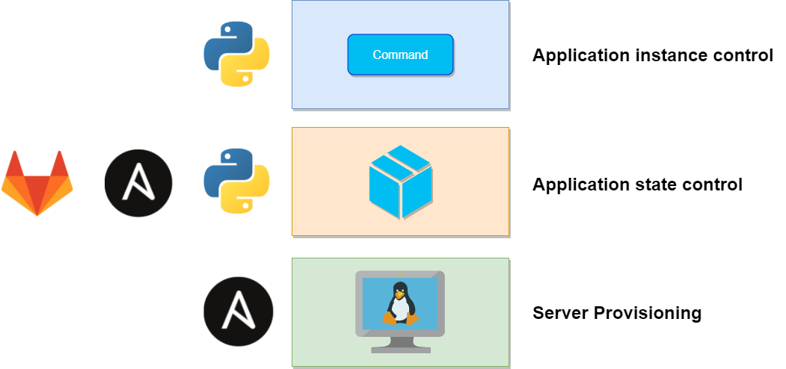

# AppRoll
Portable Ansible role which let automate lifecycle of Java Application instances in multiple sites and environments. Just create manifest file ([example](https://github.com/teymurgahramanov/AppRoll/blob/main/approll/vars/main/foo.yml)) and assests for your application and deploy it! Can be used directly with Ansible or through GitLab Pipeline.

## Features:
* Control:
    -  App version
    -  Java runtime version
    -  Site and Env based Properties
    -  Target servers
    -  and other parameters 
* Store and Distribute directory structure, static files, templated files for your Application 

## Requirements
1. Ansible (latest)
2. Identical target servers
3. Privileged user for provisioning

## How to use
### Deploy
To deploy your Java application you just need to: 
1. Define single ```.yml``` file under ```./approll/vars/main/``` as ***./approll/vars/main/foo.yml***
2. Define you project/environment variables under ```./approll/vars/main/``` as ***./approll/vars/main/properties.yml*** (Recommended to use Ansible Vault for secrets)
3. Create files and folders structure needed by your application under ```./approll/templates/%appname%```. Directory %appname% on target will have same structure. Use Jinja2 for templates as ***./approll/templates/foo/conf/db.conf.j2***
4. Define your Applications, Environments and Sites in ```./approll/vars/main/apphook.yml```. It needed by ***AppHook***.
5. Run: \
```ansible-playbook approll.yml -i approll.ini --extra-vars "app_name=%yourappname% app_env=%yourappenv% app_loc=%yourapploc" --tags "deploy"```

### Manage
Use [AppHook](https://github.com/teymurgahramanov/AppHook)

### Remove
Run:\
```ansible-playbook approll.yml -i approll.ini --extra-vars "app_name=%yourappname% app_env=%yourappenv% app_loc=%yourapploc" --tags "remove"```

## My case

* Three Environments on three geographically distributed sites.
* No access to source code.
* No ability to use package management solutions, so developers upload application packages to web server.

### Management of application infrastructure separated to three layers:


### 1. Server Provisioning
Deploy, tuning, security and other server related tasks performed by Ansible.
### 2. Application state control
Control ***how*** (App version, Java runtime version, Properties and etc.) and ***where*** (Target servers, Environments and Sites) Application will run. Everything stored in GitLab and managed through Pipelines and Ansible.
### 3. Application instance control
Control instance ***status*** (start,stop,restart) and perform ***healthchecks*** (systemd service or application endpoint). Here used [AppHook](https://github.com/teymurgahramanov/AppHook).

* Recommended to use in conjuction with [AppHook](https://github.com/teymurgahramanov/AppHook)
* healtcheck.py used in GitLab Pipeline in 'check' stage to perform HTTP healtcheck
* Developed and tested with:
    - Ansible 2.9
    - Python 3.6
__
https://t.me/teymurgahramanov
https://t.me/ITBlogbyTeymur
